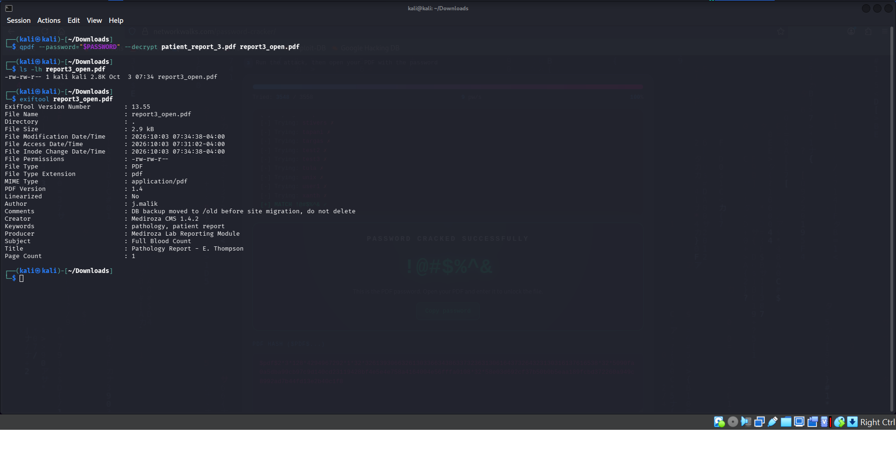
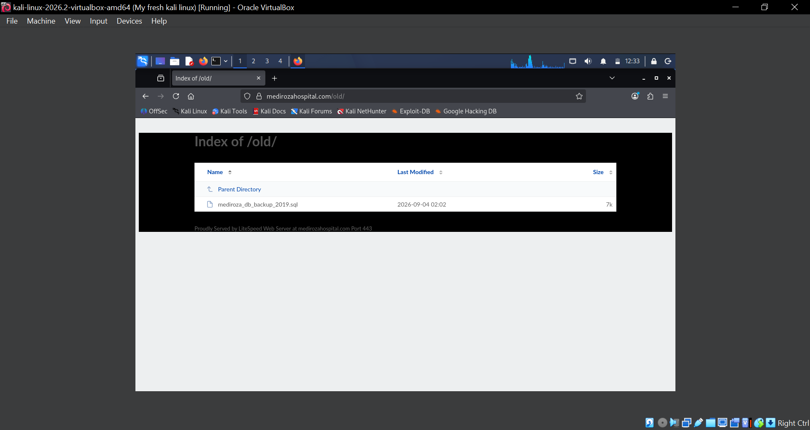
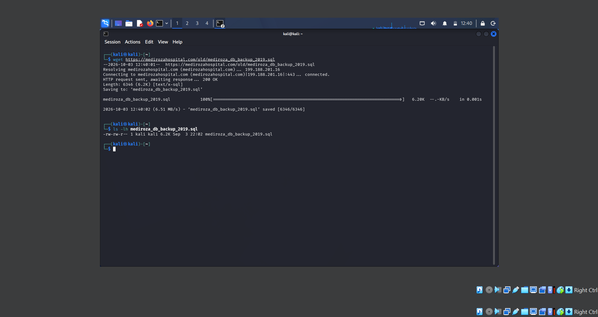

# Networkwalks-B083-Week4-Penetration-Testing
Authorized black-box penetration testing project for Mediroza General Hospital — Networkwalks Week 


# Networkwalks Week 4 Penetration Testing Project

## Client

**Mediroza General Hospital**

## Assessment Type

Authorized Black\-Box Web Application Penetration Test

## Scope

**Target:** `https://medirozahospital.com`

Testing was performed only against the authorized target as part of the Networkwalks internship project\.

1. Executive Summary

This project involved an authorized black-box penetration test of the Mediroza General Hospital web application.

The assessment followed a structured process:

1. Reconnaissance
2. Scanning and enumeration
3. Initial access
4. Password cracking
5. Deep reconnaissance
6. Findings and recommendations

Several security weaknesses were identified, including username enumeration, SQL injection, authentication bypass, unauthorized access to patient reports, weak PDF passwords, sensitive PDF metadata, an exposed backup directory, and sensitive information contained in an accessible database backup.

# 2\. Tools Used

The following tools and techniques were used during the assessment:

- WHOIS
- DNSRecon
- WhatWeb
- theHarvester
- CRT\.sh
- cURL
- Nmap
- Browser
- Networkwalks Hash Calculator
- John the Ripper
- qpdf
- ExifTool
- wget

# 3\. Methodology

The assessment followed this methodology:

**Footprinting → Scanning & Enumeration → Gaining Access → Password Cracking → Deep Reconnaissance → Findings & Recommendations**

---

# 4\. Reconnaissance

## 4\.1 WHOIS

WHOIS was used to gather domain registration information about the target\.

The information collected included the domain registrar, nameservers, creation date, and DNSSEC status\.

---

## 4\.2 DNS Reconnaissance

DNSRecon was used to gather DNS\-related information about the target domain\.

---

## 4\.3 Web Technology Enumeration

WhatWeb was used to identify technologies and server information associated with the target\.

The scan identified information such as the web server technology and other HTTP\-related details\.

4.4 HTTP Header and Website Enumeration

cURL was used to inspect HTTP responses and website resources.

The following commands were used:

curl -I https://medirozahospital.com

curl https://medirozahospital.com/robots.txt

The robots.txt file revealed the following paths:

/patient/
/staff/
/old/

###Evidence


# 5\. Milestone 1 — Initial Access

## 5\.1 Patient Login Page

The `/patient/` directory led to the patient login page:

```text
https://medirozahospital.com/patient/login.php
```

The authentication mechanism was tested to determine how the application responded to different usernames and passwords\.

---

## 5\.2 Username Enumeration

Different usernames were tested against the login form\.

The application returned different messages depending on whether the username existed\.

Examples included:

```text
Username not found
```

and:

```text
Incorrect password
```

This difference allowed valid usernames to be identified\.

### Finding

**Username Enumeration**

**Severity:** Medium

### Impact

An attacker could identify valid usernames and use them for further attacks\.

### Evidence 2 — Username Enumeration


6. SQL Injection and Authentication Bypass

6.1 SQL Injection Testing

The username field was tested with:

admin'

The application returned a SQL syntax error, indicating that user input was being incorporated into a database query.

────────

6.2 Authentication Bypass

The following authorized lab payload was then tested:

admin' --

The application accepted the input and provided access to the patient portal.

The portal displayed three patient reports.

Finding

SQL Injection / Authentication Bypass

Severity: Critical

Impact

An attacker could bypass the application’s authentication mechanism and gain access to restricted functionality.

Evidence 3 — SQL Injection Error


Caption: SQL injection testing produced a database error, demonstrating insufficient input handling.

Evidence 4 — Authentication Bypass


Caption: The authentication bypass successfully opened the patient portal.


# 7\. Unauthorized Access to Patient Reports

After successfully bypassing authentication, the patient portal displayed:

```text
patient_report_1.pdf
patient_report_2.pdf
patient_report_3.pdf
```

The reports were downloaded for further analysis within the authorized assessment\.

### Finding

**Unauthorized Access to Patient Reports**

**Severity:** High

### Impact

Successful exploitation of the authentication vulnerability allowed access to confidential patient documents\.

### Evidence 5 — Patient Reports


**Caption:** The patient portal displayed three confidential patient reports after the authentication bypass\.


# 8\. Milestone 2 — PDF Password Cracking

The downloaded PDF files were protected with passwords.

The PDF hashes were extracted and processed using the Networkwalks Hash Calculator.

The hashes began with:

$pdf$

John the Ripper was used with available wordlists to test the PDF passwords.

Two of the PDF passwords were recovered using the available wordlist.

The third PDF did not match the initial wordlist and required the John the Ripper wordlist.

The third PDF password was successfully recovered.

### Finding

Weak PDF Passwords

### Severity: High

### Impact

Weak document passwords allowed protected patient documents to be recovered using password-cracking techniques.

### Evidence 6 — PDF Hashes


Caption: PDF password hashes were extracted for password-cracking analysis.

### Evidence 7 — PDF Password Cracking


**Caption:** The PDF password was successfully recovered using a wordlist.


# 9\. PDF Decryption

The `qpdf` utility was used to decrypt the third PDF after recovering its password\.

The command used was:

```bash
qpdf --password="$PASSWORD" --decrypt patient_report_3.pdf report3_open.pdf
```

The decrypted file was successfully created as:

```text
report3_open.pdf
```


# 10\. Milestone 3 — PDF Metadata Analysis

ExifTool was used to inspect the metadata of the decrypted PDF.

The command used was:

exiftool report3_open.pdf

Important metadata discovered included:

Author   : j.malik
Comments : DB backup moved to /old before site migration, do not delete

This information provided a clue for further investigation of the /old/ directory.

### Finding

Sensitive Information in PDF Metadata

### Severity: Medium

### Impact

Metadata can unintentionally disclose internal usernames and operational information that may assist further attacks.

### Evidence 8 — PDF Decryption and Metadata


Caption: The decrypted PDF was inspected with ExifTool, revealing the author j.malik and an internal comment referencing the /old backup directory.


# 11\. Exposed Backup Directory

The `/old/` directory discovered during reconnaissance was accessed:

```text
https://medirozahospital.com/old/
```

Directory listing was enabled\.

The following database backup was discovered:

```text
mediroza_db_backup_2019.sql
```

### Finding

**Forgotten Backup Directory with Directory Listing**

**Severity:** Critical

### Impact

An attacker could discover and download sensitive files that should not be publicly accessible\.

### Evidence 10 — Exposed `/old/` Directory



**Caption:** Directory listing exposed the database backup file `mediroza_db_backup_2019.sql`\.


# 12\. Database Backup Download

The exposed database backup was downloaded using:

```bash
wget https://medirozahospital.com/old/mediroza_db_backup_2019.sql
```

The downloaded file was confirmed using:

```bash
ls -lh mediroza_db_backup_2019.sql
```

The file was successfully downloaded and was approximately 6\.2 KB\.

### Evidence 11 — Database Backup Download



**Caption:** The exposed SQL database backup was successfully downloaded for authorized analysis\.


# 13\. Database Backup Analysis

The downloaded SQL backup file was opened and reviewed to identify sensitive information stored in the database.

The INSERT INTO statements for the staff and shareholders tables were converted into readable tables for easier analysis.

### Staff Database

### Staff Database

|ID|Name                   |Job Title               |Department        |Monthly Salary (ZAR)|
|-:|-----------------------|------------------------|------------------|-------------------:|
|1 |Dr. Rajesh Naidoo      |Chief Pathologist       |Diagnostics Lab   |138,000             |
|2 |Sarah Botha            |Chief Financial Officer |Finance           |152,000             |
|3 |Dr. Johan van der Merwe|Medical Director        |Management        |160,000             |
|4 |Dr. Anita Naicker      |Consultant Cardiologist |Cardiology        |132,000             |
|5 |Dr. Ahmed Kara         |Consultant Physician    |Internal Medicine |128,000             |
|6 |Dr. Yusuf Cassim       |Senior Registrar        |Emergency & Trauma|74,000              |
|7 |Michael Roberts        |HR Director             |Human Resources   |96,000              |
|8 |Susan Pretorius        |HR Officer              |Human Resources   |32,000              |
|9 |Jameel Malik           |IT Systems Administrator|IT                |58,000              |
|10|Thabo Molefe           |Network Engineer        |IT                |46,000              |
|11|Nomvula Khumalo        |Registered Nurse        |Emergency & Trauma|34,000              |
|12|Lerato Mokoena         |Registered Nurse        |Pediatrics        |33,000              |
|13|Bongani Ndlovu         |Registered Nurse        |Cardiology        |35,000              |
|14|Zanele Mahlangu        |Nursing Sister          |Theatre           |42,000              |
|15|Kagiso Sithole         |Pharmacist              |Pharmacy          |61,000              |
|16|Naledi Zulu            |Pharmacy Assistant      |Pharmacy          |26,000              |
|17|Themba Nkosi           |Radiographer            |Radiology         |44,000              |
|18|Palesa Radebe          |Radiographer            |Radiology         |43,000              |
|19|Deepak Pillay          |Lab Technologist        |Diagnostics Lab   |41,000              |
|20|Kavitha Govender       |Lab Technician          |Diagnostics Lab   |35,000              |
|21|Dr. Suresh Moodley     |Consultant Radiologist  |Radiology         |130,000             |
|22|Dr. Fatima Patel       |Pediatrician            |Pediatrics        |118,000             |
|23|Nisha Singh            |Physiotherapist         |Rehabilitation    |48,000              |
|24|Dr. Vikram Chetty      |Anaesthetist            |Theatre           |135,000             |
|25|David Smith            |Facilities Manager      |Operations        |52,000              |
|26|Karen O’Connor         |Billing Administrator   |Finance           |29,000              |
|27|James Wilson           |Security Supervisor     |Operations        |27,000              |
|28|Linda Fourie           |Receptionist            |Front Office      |19,000              |
|29|Peter van Wyk          |Procurement Officer     |Supply Chain      |38,000              |
|30|Andile Mbeki           |Ward Clerk              |Administration    |21,000              |

### Shareholders Database


|ID|Shareholder                    |Share Percentage|Shares Held|Share Class |
|-:|-------------------------------|---------------:|----------:|------------|
|1 |Dr. Rajesh Naidoo              |18%             |180,000    |Ordinary    |
|2 |Cedar Health Holdings (Pty) Ltd|15%             |150,000    |Ordinary    |
|3 |Dr. Johan van der Merwe        |12%             |120,000    |Ordinary    |
|4 |Reddy Family Trust             |11%             |110,000    |Ordinary    |
|5 |Thabo Molefe                   |10%             |100,000    |Ordinary    |
|6 |Sarah Botha                    |9%              |90,000     |Ordinary    |
|7 |Dr. Ahmed Kara                 |8%              |80,000     |Preferential|
|8 |Naledi Zulu                    |7%              |70,000     |Ordinary    |
|9 |Michael Roberts                |6%              |60,000     |Ordinary    |
|10|Dr. Vikram Chetty              |4%              |40,000     |Preferential|

**Note:** Sensitive direct identifiers such as national ID numbers, phone numbers and email addresses are not included in this public report.

### 14. Connecting the PDF Metadata to the Database

The PDF metadata provided an important clue that connected the exposed patient report to the database backup.

The decrypted PDF metadata showed:

* Author: j.malik
* Comments: DB backup moved to /old before site migration, do not delete
* Creator: Mediroza CMS 1.4.2
* Producer: Mediroza Lab Reporting Module

The `j.malik` author identifier was then compared with the staff records found in the exposed SQL database\.

The staff table contained:

**Jameel Malik — IT Systems Administrator — IT Department**

His email address in the database also used the `j.malik` identifier\.

This connected the evidence together:

```text
Patient Report 3
       ↓
PDF Metadata
       ↓
Author: j.malik
       ↓
Staff Database
       ↓
Jameel Malik
       ↓
IT Systems Administrator
       ↓
PDF comment references /old
       ↓
/old/ directory
       ↓
mediroza_db_backup_2019.sql
```


This demonstrated how information from the patient PDF could be correlated with information in the exposed database backup.

### 15. Security Impact

The exposed backup contained sensitive organizational information, including staff information, salaries and shareholder information.

The combination of:

* Authentication bypass
* Access to confidential patient reports
* Weak PDF passwords
* Sensitive PDF metadata
* Directory listing enabled on /old/
* Publicly accessible database backup
* Sensitive information stored in the backup

created multiple security risks.

The exposed backup could allow an attacker to obtain information that should not be publicly accessible.

### 16. Recommendations

1. Use prepared statements
    * Prevent SQL injection by using parameterized queries.
2. Fix authentication errors
    * Avoid revealing whether a username exists.
    * Use a consistent login error message.
3. Implement proper access controls
    * Patient reports should only be accessible to authorized users.
4. Use strong unique passwords
    * Avoid weak or commonly used passwords for encrypted documents.
5. Remove sensitive PDF metadata
    * Review and sanitize metadata before publishing or distributing documents.
6. Disable directory listing
    * Directory browsing should not be enabled on sensitive directories.
7. Remove old backups from public web directories
    * Database backups should never be stored in publicly accessible web folders.
8. Protect database backups
    * Store backups securely with appropriate access controls and encryption.

# 17\. Conclusion

This assessment identified several security weaknesses in the Mediroza Hospital web application.

The most significant issues included SQL injection leading to authentication bypass, exposure of confidential patient reports, weak PDF passwords, sensitive metadata, and an exposed database backup containing sensitive organizational information.

The assessment demonstrates how multiple small weaknesses can be chained together to expose increasingly sensitive information.

All testing was performed within the authorized scope of the Networkwalks Week 4 educational penetration testing project.


# 👤 Author

**Chesangha Quinneta**

**Networkwalks 2026 Intern**

LinkedIn: [https://www\.linkedin\.com/in/cyber\~\-nneta\-77a37b3ab?utm\_source=share\_via&utm\_content=profile&utm\_medium=member\_ios](https://www.linkedin.com/in/cyber~-nneta-77a37b3ab?utm_source=share_via&utm_content=profile&utm_medium=member_ios)

---

## Project Information

**Program Name:** Cybersecurity at Networkwalks \| **Week:** 04 \| **Project:** Cybersecurity & Black\-Box Penetration Testing \| **Repository:** GitHub


