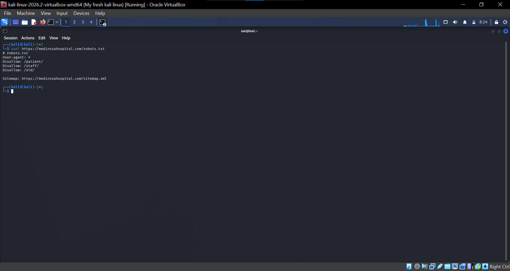
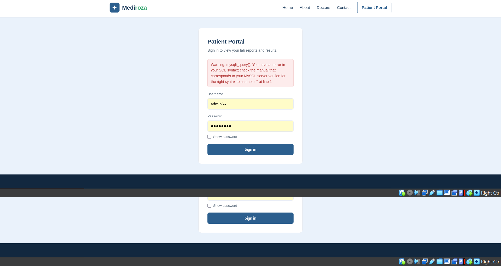
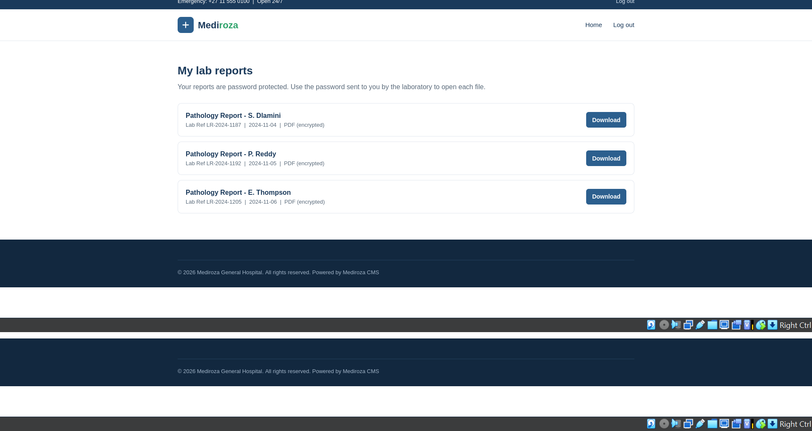
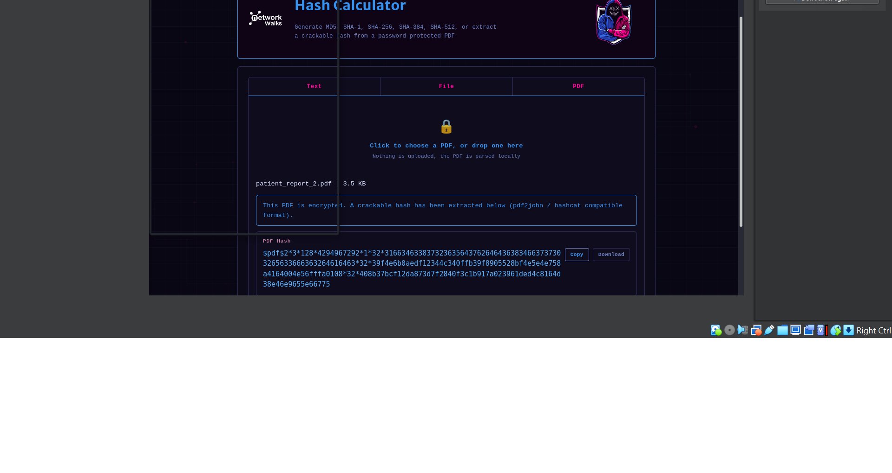

# Networkwalks-B083-Week4-Penetration-Testing
Authorized black-box penetration testing project for Mediroza General Hospital — Networkwalks Week 


# Networkwalks Week 4 Penetration Testing Project

## Client

**Mediroza General Hospital**

## Assessment Type

Authorized Black\-Box Web Application Penetration Test

## Scope

**Target:** `https://medirozahospital.com`

Testing was performed only against the authorized target as part of the Networkwalks internship project\.

1. Executive Summary

This project involved an authorized black-box penetration test of the Mediroza General Hospital web application.

The assessment followed a structured process:

1. Reconnaissance
2. Scanning and enumeration
3. Initial access
4. Password cracking
5. Deep reconnaissance
6. Findings and recommendations

Several security weaknesses were identified, including username enumeration, SQL injection, authentication bypass, unauthorized access to patient reports, weak PDF passwords, sensitive PDF metadata, an exposed backup directory, and sensitive information contained in an accessible database backup.

# 2\. Tools Used

The following tools and techniques were used during the assessment:

- WHOIS
- DNSRecon
- WhatWeb
- theHarvester
- CRT\.sh
- cURL
- Nmap
- Browser
- Networkwalks Hash Calculator
- John the Ripper
- qpdf
- ExifTool
- wget

# 3\. Methodology

The assessment followed this methodology:

**Footprinting → Scanning & Enumeration → Gaining Access → Password Cracking → Deep Reconnaissance → Findings & Recommendations**

---

# 4\. Reconnaissance

## 4\.1 WHOIS

WHOIS was used to gather domain registration information about the target\.

The information collected included the domain registrar, nameservers, creation date, and DNSSEC status\.

---

## 4\.2 DNS Reconnaissance

DNSRecon was used to gather DNS\-related information about the target domain\.

---

## 4\.3 Web Technology Enumeration

WhatWeb was used to identify technologies and server information associated with the target\.

The scan identified information such as the web server technology and other HTTP\-related details\.

4.4 HTTP Header and Website Enumeration

cURL was used to inspect HTTP responses and website resources.

The following commands were used:

curl -I https://medirozahospital.com

curl https://medirozahospital.com/robots.txt

The robots.txt file revealed the following paths:

/patient/
/staff/
/old/

###Evidence



# 5\. Milestone 1 — Initial Access

## 5\.1 Patient Login Page

The `/patient/` directory led to the patient login page:

```text
https://medirozahospital.com/patient/login.php
```

The authentication mechanism was tested to determine how the application responded to different usernames and passwords\.

---

## 5\.2 Username Enumeration

Different usernames were tested against the login form\.

The application returned different messages depending on whether the username existed\.

Examples included:

```text
Username not found
```

and:

```text
Incorrect password
```

This difference allowed valid usernames to be identified\.

### Finding

**Username Enumeration**

**Severity:** Medium

### Impact

An attacker could identify valid usernames and use them for further attacks\.

### Evidence 2 — Username Enumeration




6. SQL Injection and Authentication Bypass

6.1 SQL Injection Testing

The username field was tested with:

admin'

The application returned a SQL syntax error, indicating that user input was being incorporated into a database query.

────────

6.2 Authentication Bypass

The following authorized lab payload was then tested:

admin' --

The application accepted the input and provided access to the patient portal.

The portal displayed three patient reports.

Finding

SQL Injection / Authentication Bypass

Severity: Critical

Impact

An attacker could bypass the application’s authentication mechanism and gain access to restricted functionality.

Evidence 3 — SQL Injection Error


Caption: SQL injection testing produced a database error, demonstrating insufficient input handling.

Evidence 4 — Authentication Bypass


Caption: The authentication bypass successfully opened the patient portal.


# 7\. Unauthorized Access to Patient Reports

After successfully bypassing authentication, the patient portal displayed:

```text
patient_report_1.pdf
patient_report_2.pdf
patient_report_3.pdf
```

The reports were downloaded for further analysis within the authorized assessment\.

### Finding

**Unauthorized Access to Patient Reports**

**Severity:** High

### Impact

Successful exploitation of the authentication vulnerability allowed access to confidential patient documents\.

### Evidence 5 — Patient Reports


**Caption:** The patient portal displayed three confidential patient reports after the authentication bypass\.


8. Milestone 2 — PDF Password Cracking

The downloaded PDF files were protected with passwords.

The PDF hashes were extracted and processed using the Networkwalks Hash Calculator.

The hashes began with:

$pdf$

John the Ripper was used with available wordlists to test the PDF passwords.

Two of the PDF passwords were recovered using the available wordlist.

The third PDF did not match the initial wordlist and required the John the Ripper wordlist.

The third PDF password was successfully recovered.

Finding

Weak PDF Passwords

Severity: High

Impact

Weak document passwords allowed protected patient documents to be recovered using password-cracking techniques.

Evidence 6 — PDF Hashes


Caption: PDF password hashes were extracted for password-cracking analysis.

Evidence 7 — PDF Password Cracking


Caption: The PDF password was successfully recovered using a wordlist.


